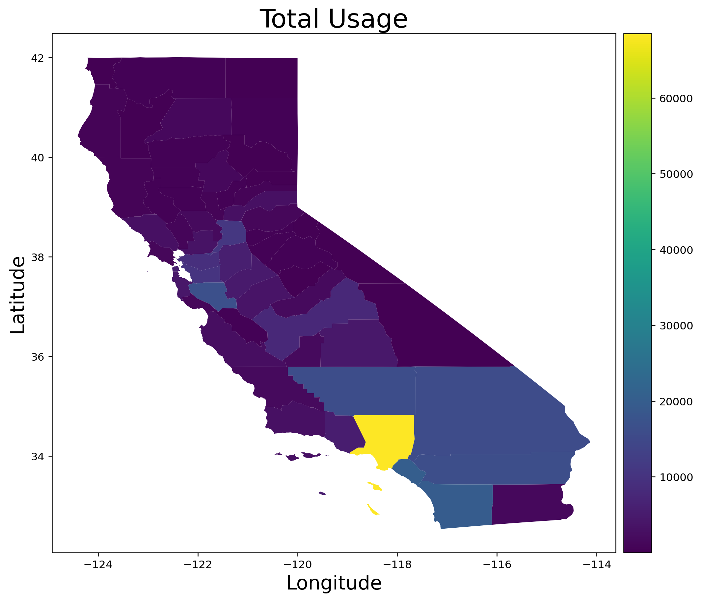
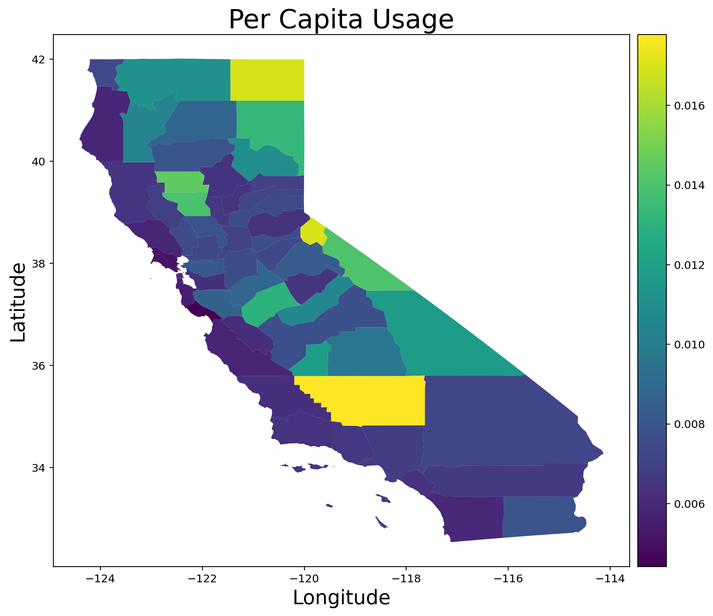
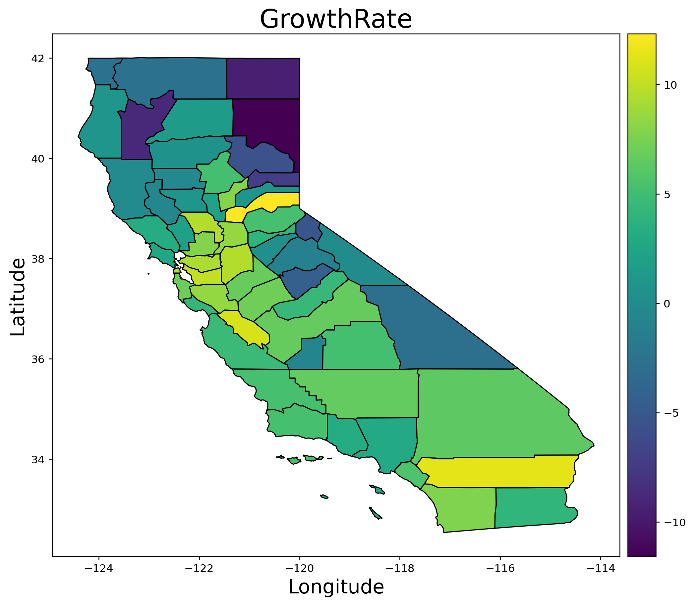

# California power generation:  planning for the future

## Problem Statement:

Electrical power generation in the state of California comes from a patchwork of predominantly natural gas, hydro, and renewable energy power as well as a single nuclear powerplant (Diablo Canyon) and a few large out of state sources (Columbia River hydro, Utah coal plants, etc). As the population changes and the restrictions on non-renewable energy sources are tightened, how will the California power production and consumption change?  In this project I seek to predict where there may be opportunities to capture new market demands in an efficient and profitable way.

## Background

The table below shows the current breakdown of California power production.

| Fuel Type | In-State Generation (GWh) |  In-State Generation (%) | NW Imports (GWh) | SW Imports (GWh) | Energy Mix (GWh) | Power Mix (%) |
| - | - | - | - | - | - | - |
| Coal | 294 | 0.15% | 399 | 8,740 | 9,433 | 3.30% |
| Large Hydro | 22,096 | 11.34% | 7,418 | 985 | 30,499 | 10.68% |
| Natural Gas | 90,691 | 46.54% | 49 | 8,904 | 99,644 | 34.91% |
| Nuclear | 18,268 | 9.38% | 0 | 7,573 | 25,841 | 9.05% |
| Oil | 35 | 0.02% | 0 | 0 | 35 | 0.01% |
| Other | 430 | 0.22% | 0 | 9 | 439 | 0.15% |
| Renewables | 63,028 | 32.35% | 14,074 | 12,400 | 89,502 | 31.36% |
| Biomass | 5,909 | 3.03% | 772 | 26 | 6,707 | 2.35% |
| Geothermal | 11,528 | 5.92% | 171 | 1,269 | 12,968 | 4.54% |
| Small Hydro | 4,248 | 2.18% | 334 | 1 | 4,583 | 1.61% |
| Solar | 27,265 | 13.99% | 174 | 5,094 | 32,533 | 11.40% |
| Wind | 14,078 | 7.23% | 12,623 | 6,010 | 32,711 | 11.46% |
| Unspecified | N/A | N/A | 17,576 | 12,519 | 30,095 | 10.54% |
| Total | 194,842 | 100.00% | 39,517 | 51,130 | 285,488 | 100.00% |

**Other:** Petroleum Coke/Waste Heat

The map below shows power consumption by county.  Note that Los Angeles county consumes substantially more power than any other county in California.

The map below shows per capita power consumption by county.  Note that Kern county is actually the largest per capita consumer of power in California.

The map below shows the population growth rate by county as a percentage. Note that most counties show some amount of growth, with only rural outlying counties showing negative growth.

