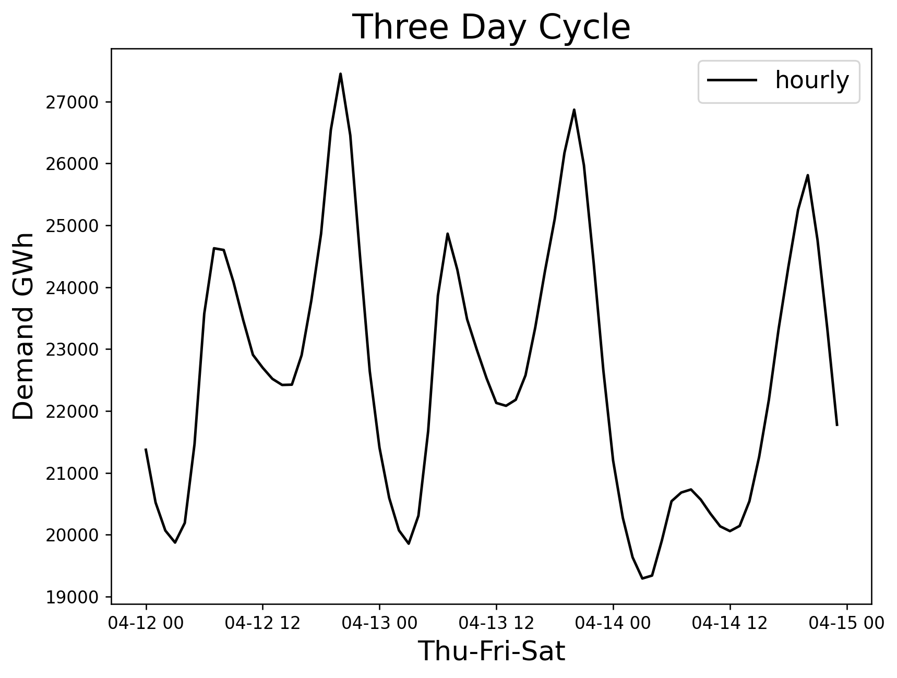
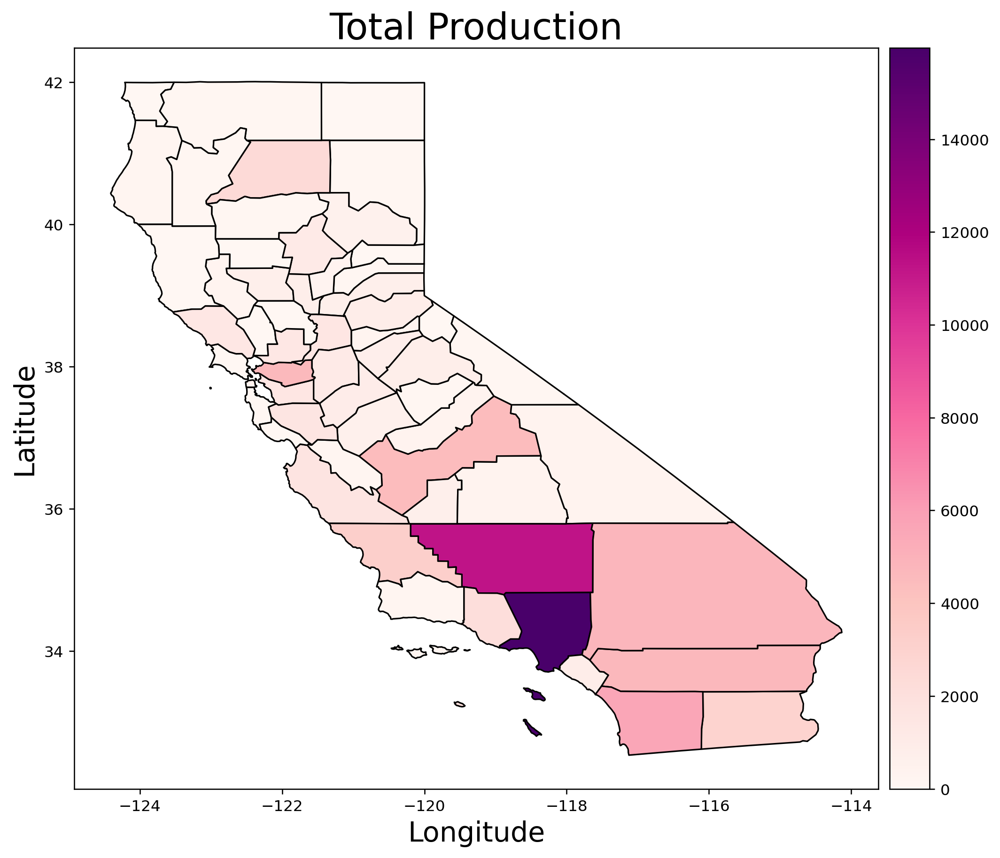
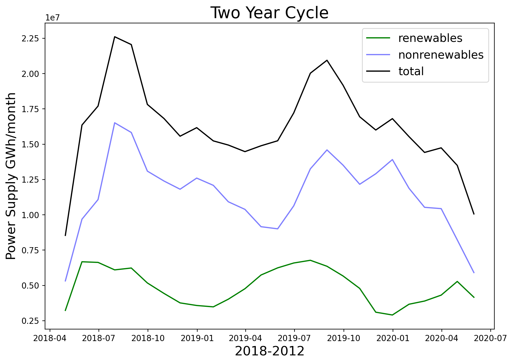
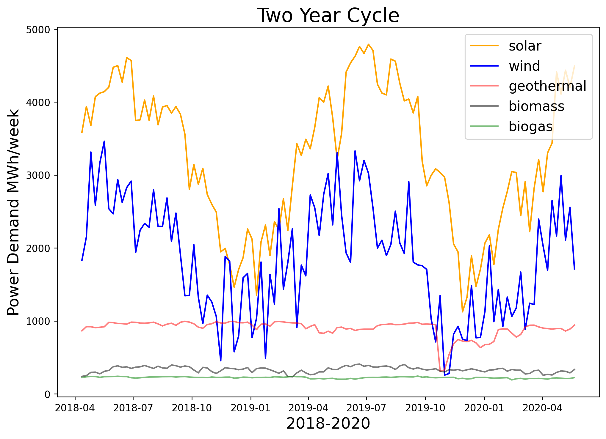
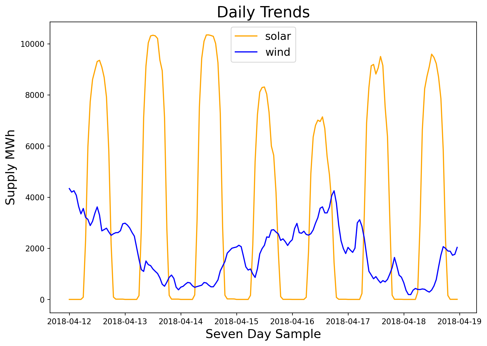

# California power:  optimizing a flexible grid

## Problem Statement:

In an effort to reduce greenhouse emissions, the state of California is pursuing an expansion of its renewable energy portfolio. While green power sources like solar and wind are emissions free they are not constant, it is not always sunny and it is not always windy. To make best use of these time-variable resources it is important to have an accurate production forecast so that other flexible fuel sources like gas and hydro can be prepared to meet the net demand. To achieve this goal I incorporate time series weather and electricity supply data to model seasonal and daily fluctuations and produce a week-ahead forecast model for wind and solar contributions to the California state energy portfolio.

## Background
Electrical power generation in the state of California comes from a patchwork of natural gas, hydro, and renewable energy power as well as a single nuclear powerplant (Diablo Canyon) and a few large out of state sources (Columbia River hydro, Utah coal plants, etc). The table below shows the current breakdown of California power production.

| Fuel Type | In-State Generation (GWh) |  In-State Generation (%) | NW Imports (GWh) | SW Imports (GWh) | Energy Mix (GWh) | Power Mix (%) |
| - | - | - | - | - | - | - |
| Coal | 294 | 0.15% | 399 | 8,740 | 9,433 | 3.30% |
| Large Hydro | 22,096 | 11.34% | 7,418 | 985 | 30,499 | 10.68% |
| Natural Gas | 90,691 | 46.54% | 49 | 8,904 | 99,644 | 34.91% |
| Nuclear | 18,268 | 9.38% | 0 | 7,573 | 25,841 | 9.05% |
| Oil | 35 | 0.02% | 0 | 0 | 35 | 0.01% |
| Other | 430 | 0.22% | 0 | 9 | 439 | 0.15% |
| Renewables | 63,028 | 32.35% | 14,074 | 12,400 | 89,502 | 31.36% |
| Biomass | 5,909 | 3.03% | 772 | 26 | 6,707 | 2.35% |
| Geothermal | 11,528 | 5.92% | 171 | 1,269 | 12,968 | 4.54% |
| Small Hydro | 4,248 | 2.18% | 334 | 1 | 4,583 | 1.61% |
| Solar | 27,265 | 13.99% | 174 | 5,094 | 32,533 | 11.40% |
| Wind | 14,078 | 7.23% | 12,623 | 6,010 | 32,711 | 11.46% |
| Unspecified | N/A | N/A | 17,576 | 12,519 | 30,095 | 10.54% |
| Total | 194,842 | 100.00% | 39,517 | 51,130 | 285,488 | 100.00% |

**Other:** Petroleum Coke/Waste Heat

### Power consumption at the county scale
The map below shows log power consumption by county.  As expected the two major metropolitan areas in the San Francisco Bay region and greater Los Angeles region consume the lions share of electricity in California. Also of note is the Sacramento River delta region, San Joaquin Valley, and the Imperial Valley. Note that the color scale here is in log GWh, this choice was made because Los Angeles county consumes substantially more power than any other county in California and when plotted on a linear scale it is difficult to see the next highest contenders .

## Demand forecasting

#### Two year cycle
- Seasonal changes
- High in the summer low in the winter
- Daily deviations are relatively strong

#### Three day cycle
- Morning pulse, afternoon lag, evening pulse, nightly drop
- Weekend morning low

#### Autoregression model
- Trained on two years of demand data
- Computes week ahead prediction in late May, 2020
- Overpredicts Mon-Wed-Fri (COVID?)
- Captures weekend low
- Needs tuning on annual seasons, manages weekends

## Supply forecasting
- LA County produces the most

- Annual flucturations

- Highlight fluctuations in renewables at daily scale
- Highlight imports

### Renewables

- Higher in summer, lower in winter

- Daily trends

### Solar

- Cluster map

- Week ahead forecast

### Combine AR ahead with UV cluster model
- Forecast net demand

### Wind forecasting
- Cluster map
- Day ahead
- Week ahead

## Planning for population change
The California power portfolio is not the only thing changing with time.  Making up nearly 15% of the nations GDP, California is an appealing state to live in and will likely see continued growth in the coming decades. The map below combines per capita power consumption by county multiplied by the percent population change measured between the 2010 and 2020 census.  While the units on this color scale are arbitrary, this map gives an idea of where increased demand is likely to arise in the near future. Regions of interest include the East Bay, Sacramento River Delta, northern San Joaquin Valley, Kern county and Riverside county. 

