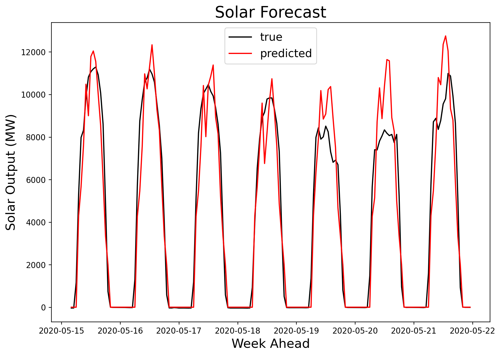
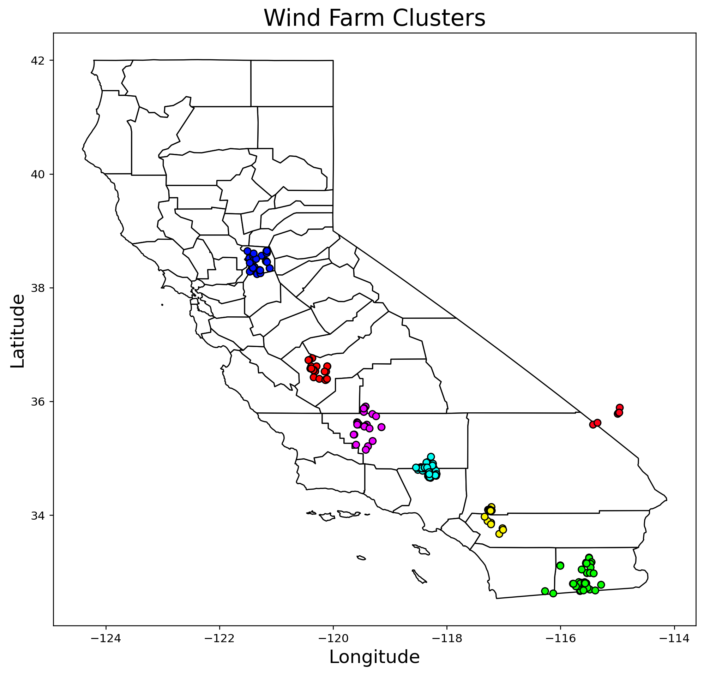
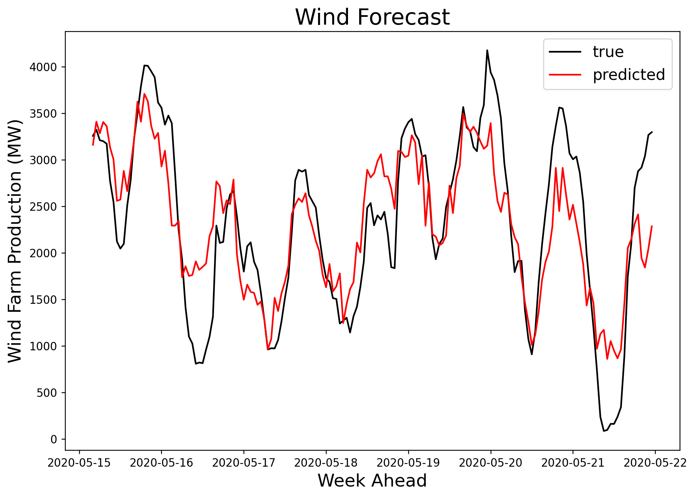
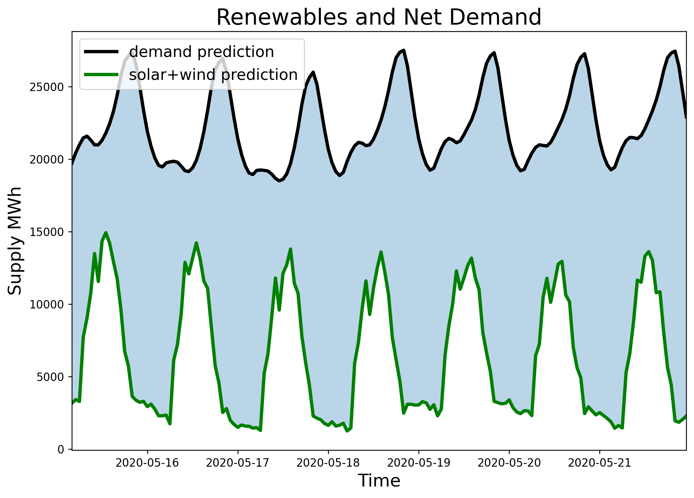
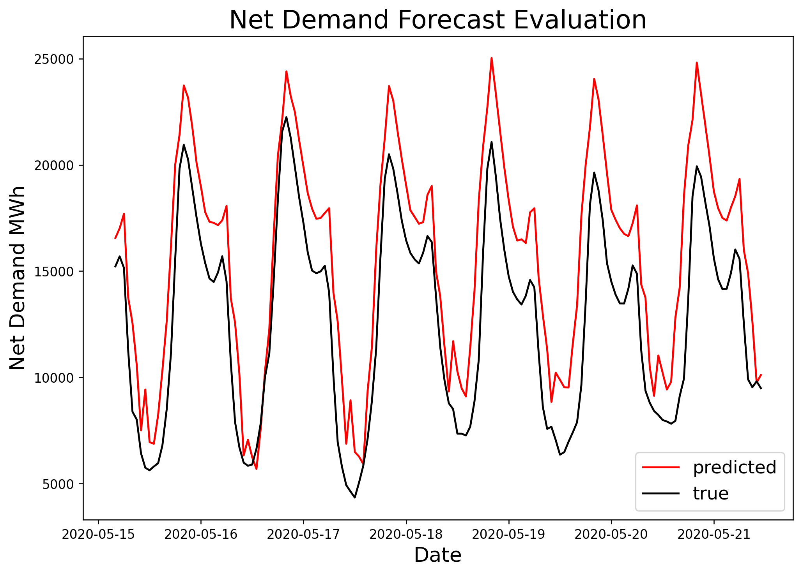

# California power:  optimizing a flexible grid

In an effort to reduce greenhouse emissions, the state of California is pursuing an expansion of its renewable energy portfolio. While green power sources like solar and wind are emissions free they are not constant, it is not always sunny and it is not always windy. To make best use of these time-variable resources it is important to have an accurate production forecast so that other flexible fuel sources like gas and hydro can be prepared to meet the net demand. To achieve this goal I use time-series analysis to model seasonal and daily fluctuations in power demand and use linear regression on time-series weather data to produce a week-ahead production forecast for wind and solar contributions to the California state energy portfolio.

## Executive Summary

The net electrical demand after contributions from renewable energy is met predominantly by gas turbine and hydro plants.  These are fuel sources that can ramp relatively flexibly to fill in the gaps when solar and wind are below optimal productivity. In order for these systems to work effectively together we must be able to forecast three things:

1. **Total Electrical Demand**
2. **Contributions from solar** 
3. **Contributions from wind**

From these three forecasts it is possible to estimate the net demand to be met by gas and hydro:

**Net Demand = Total Electrical Demand - (Solar + Wind)**

Gas and hydro plant operators can use this information to be prepared for a range of ramp rates depending on the forecast.

## Repository Contents
Section names link to methods summaries, notebook names link to jupyter notebooks containing the described code. This repository is self-contained and can be forked, cloned, and excecuted as is. A brief summary of results can be found [here](https://github.com/sjhawkes/cal_power/blob/master/cal_power.pdf).

| Section | Notebooks | Description |
| - | - | - |
| <a href='#demand_forecasting'>Demand Forecasting</a> | [CAISO demand scraper](https://github.com/sjhawkes/cal_power/blob/master/code/01A_DemandScraper.ipynb) | Collects time series data demand data from the  California ISO webpage |
| | [Demand EDA](https://github.com/sjhawkes/cal_power/blob/master/code/01B_DemandEDA.ipynb) | Exploratory data analysis of demand data |
| | [Autogression model](https://github.com/sjhawkes/cal_power/blob/master/code/01C_DemandARModel.ipynb) | Creates week ahead demand forecast from two years of time-series demand data from 2018-2020 |
| <a href='#supply_analysis'>Supply Analysis</a> | [CAISO supply scraper](https://github.com/sjhawkes/cal_power/blob/master/code/02A_SupplyTotalScraper.ipynb) | Collects time series data electrical supply data from the  California ISO webpage |
| | [CAISO renewables scraper](https://github.com/sjhawkes/cal_power/blob/master/code/02B_SupplyRenewableScraper.ipynb) | Collects time series renewable supply data from California ISO webpage |
| | [Supply EDA](https://github.com/sjhawkes/cal_power/blob/master/code/02C_SupplyEDA.ipynb) | Exploratory data analysis of electrical supply data |
| <a href='#solar_forecasting'>Solar Forecasting</a> | [Kmeans clustering of solar plants](https://github.com/sjhawkes/cal_power/blob/master/code/03A_SolarKMeansClustering.ipynb) | Groups over 800 solar power plants by lat-lon coordinates into 30 clusters with similar weather |
| | [UV index scraper](https://github.com/sjhawkes/cal_power/blob/master/code/03B_SolarUVScraper.ipynb) | Collects time-series UV index data from darksky.net |
| | [Linear regression model](https://github.com/sjhawkes/cal_power/blob/master/code/03C_SolarLRModel.ipynb) | Creates week ahead forecast for solar output from training on UV index data and time of day versus solar production |
| <a href='#wind_forecasting'>Wind Forecasting</a> | [Kmeans clustering of wind plants](https://github.com/sjhawkes/cal_power/blob/master/code/04A_WindKMeansClustering.ipynb) | Groups over 100 wind farms by lat-lon coordinates into 7 clusters with similar weather |
| | [Wind speed scraper](https://github.com/sjhawkes/cal_power/blob/master/code/04B_WindSpeedScraper.ipynb) | Collects time-series wind speed data from darsky.net |
| | [Linear regression model](https://github.com/sjhawkes/cal_power/blob/master/code/04C_WindLRModel.ipynb) | Creates week ahead forecast for solar output from training on time-series windspeed and humidity data versus wind production |
| <a href='#net_demand_forecasting'>Net Demand Forecasting</a> | [Net demand forecast](https://github.com/sjhawkes/cal_power/blob/master/code/05A_NetDemandForecast.ipynb) | Combines demand forecast, solar production forecast, and wind production forecast in order to model net demand |
| <a href='#energy_maps'>Energy Maps</a> | [County mapper](https://github.com/sjhawkes/cal_power/blob/master/code/06_CountyMapper.ipynb) | Creates choropleth maps of power production/consumption by county, population and population change, and types of power production |

### Software Requirements

**Data Collection**
- Webdriver Manager
- Selenium
- Urllib

**Data Manipulation and Visualization**
- Pandas
- Numpy
- Matplotlib
- Geopandas

**Data Modeling**
- Statsmodels
- Sklearn

## Background

The map above shows log power consumption by county.  As expected the two major metropolitan areas in the San Francisco Bay region and greater Los Angeles region consume the lions share of electricity in California. Also of note is the Sacramento River delta region, San Joaquin Valley, and the Imperial Valley. Note that the color scale here is in log GWh, this choice was made because Los Angeles county consumes substantially more power than any other county in California and when plotted on a linear scale it is difficult to see the next highest contenders .

Electrical power generation in the state of California comes from a patchwork of natural gas, hydro, and renewable energy power as well as a single nuclear powerplant (Diablo Canyon) and a few large out of state sources (Columbia River hydro, Utah coal plants, etc). The table below shows the current breakdown of California power production.

| Fuel Type | In-State Generation (GWh) |  In-State Generation (%) | NW Imports (GWh) | SW Imports (GWh) | Energy Mix (GWh) | Power Mix (%) |
| - | - | - | - | - | - | - |
| Coal | 294 | 0.15% | 399 | 8,740 | 9,433 | 3.30% |
| Large Hydro | 22,096 | 11.34% | 7,418 | 985 | 30,499 | 10.68% |
| Natural Gas | 90,691 | 46.54% | 49 | 8,904 | 99,644 | 34.91% |
| Nuclear | 18,268 | 9.38% | 0 | 7,573 | 25,841 | 9.05% |
| Oil | 35 | 0.02% | 0 | 0 | 35 | 0.01% |
| Other | 430 | 0.22% | 0 | 9 | 439 | 0.15% |
| Renewables | 63,028 | 32.35% | 14,074 | 12,400 | 89,502 | 31.36% |
| Biomass | 5,909 | 3.03% | 772 | 26 | 6,707 | 2.35% |
| Geothermal | 11,528 | 5.92% | 171 | 1,269 | 12,968 | 4.54% |
| Small Hydro | 4,248 | 2.18% | 334 | 1 | 4,583 | 1.61% |
| Solar | 27,265 | 13.99% | 174 | 5,094 | 32,533 | 11.40% |
| Wind | 14,078 | 7.23% | 12,623 | 6,010 | 32,711 | 11.46% |
| Unspecified | N/A | N/A | 17,576 | 12,519 | 30,095 | 10.54% |
| Total | 194,842 | 100.00% | 39,517 | 51,130 | 285,488 | 100.00% |

**Other:** Petroleum Coke/Waste Heat
**Source:** link

## Renewable Energy

Renewable energy sources in California have become a major contributor the state production portfolio in recents years. During the daylight hours when solar power is at maximum efficiency, renewables can make up over half of the state supply of electricity.  However, since major renewable sources like solar and wind have a highly variable output, other nonrenewable sources like natural gas and coal (mostly out of state imports) must be used to fill in the gaps.

**Three Day Supply**

The graph above shows a typical three day supply trend. Note renewables peak in the middle of the day. While all the supply sources show variation it is important to remember that solar and wind production are externally controlled by climate conditions while natural gas, hydro, and imports are ramped in response to these independent weather-controlled inputs.

**One Week Renewable Trends**

The graph above shows renewable enegy trends for a week in April 2018. Note that geothermal, biogas, and biomass all remain relatively steady while solar and wind production show significant variation. Solor shows day/night changes but also shows large daily changes, for example on the fifth day on this chart the solar output is only about 60% of that on the 2nd and 3rd day. The variation in wind production is less period but also shows a high degree of variability (500-4000 MW).

**Two Year Cycle**

The graph above shows the annual variations in energy supply for renewable vs nonrenewable energy. The nonrenewable curve represents the net demand that must be accounted for after contributions from renewable sources. Keeping in mind that solar and wind make up the only real variation in renewables, we can see that there is a large amount of seasonal variation in contribution to the overall energy portfolio. The purpose of this study to forecast the variations in solar and wind ouput so that we can make a net demand forecast for nonrenewables to fill in the remaining demand.

## Methods

I combine three forecasts to generate a net demand forecast:

**Forecasts**

1. Demand Forecast
2. Solar Forecast
3. Wind Forecast

I combine five data sets to generate these forecasts:

**Data**

- Solar plant and wind farm locations and capacity: [CEC Powerplants Database](https://cecgis-caenergy.opendata.arcgis.com/datasets/california-power-plants)
- Time series electrical demand data for the state of California: [CAISO](http://www.caiso.com/TodaysOutlook/Pages/default.aspx)
- Time series solar and wind production data for the state of California: [CAISO](http://www.caiso.com/TodaysOutlook/Pages/supply.aspx)
- Time series windpeed data: [Darksky](https://darksky.net/details/34,-118/2020-6-7/us12/en)
- Time series UV index data: [Darksky](https://darksky.net/details/34,-118/2020-6-7/us12/en)

#### Demand Forecast

A one week electrical demand forecast is produced for the whole state of California in this section.  The source data for this modeling comes from the California Independent System Operator (CAISO) webpage, which provides time-series demand data at 5 minutes sampling intervals from April 12, 2018 to the present. This datasets details the instantaneous load in GWh that must be met by the California electrical grid.

**Two year cycle**

The demand curve shows annual, weekly, and daily seasonal trends
- Higher demand in the summer months and lower demand in the winter months
- Weekend mornings are significantly lower lower than weekday mornings
- Daily cycle is predictably low at night with a morning pulse, afternoon ease, and another
- Daily deviations are relatively strong, up to 50% in the lower demand winter seasonlarger pulse in the evening
- April 2020 is anomalously low, likely due to office building hibernation during COVID-19

**Autoregression model**

To generate the forecast I used an autoregression model with 312 lagged channels and trained it on more than two years worth of hourly demand data, over 18,000 samples in total. The forecast covers 7 days in late May, 2020 and is evaluated using the mean squared error measurment as well as visual analysis of the true and predicted curves.

- Overpredicts Mon-Wed-Fri
- Captures weekend low
- Needs tuning on annual seasons, manages weekends

#### Solar Forecast

Solar power in California comes from a collection of 849 plants distributed throughout the state as well as imports from plants in Nevada and Arizona. To forecast output from these plants, I collected time-series UV index from Darksky. This website keeps historical weather data accessible and is searchable using lat-lon coordinates and dates. Rather than collect weather data on over 800 locations, I used KMeans clustering to group solar plants into populations that should have similar weather forecasts.

**Solar Farm Clusters**

The colors on the map above indicate the identity of the power plant clusters. UV index data is collected for the center of each grouping and is weighted by the total sum of the cluster production capacity. This data serves as the input to a linear regression model that is trained on total solar farm production data.

**Solar Forecast**

The graph above shows the results of the linear regression model used to forecast ahead one week of solar plant production from time-series UV index data. The model explains 91.5% of the variation in production and matches daily variations well. Production around midday tends to be overpredicted and production in the morning and evening tends to be underestimated. To capture these more effectively I plan to incorporate features for day of year and hour of day in future versions.

### Wind forecasting

Wind power in California contributed by 137 wind farms. I used KMeans clustering to reduce the number of locations to 7 groups with similar weather forecasts. Three months of wind speed data is collected for each centroid location and weighted by the total cluster production capacity.

**Wind Farm Clusters**

Wind speed data from the seven clusters shown on the map above are used as the inputs to a linear regression model. The model relies only on windspeed and the total windfarm capacity.

The graph above shows the predicted wind farm production forecast derived from the linear regression model. The model describes 70% of the variation in wind production. The overall changes in production are well accounted for, however the lows are significantly over predicted. This model is very simple at the moment and could likely be improved by collecting humidity, temperature, and pressure data, as these effect the air viscosity and therefore speed at which the windmill blades can spin.

### Net Demand

A net demand forecast is provided to inform ramping of gas and hydro plants to meet total demand for the State of California, after contributions from wind and solar.

**Renewables and Net Demand**

After contributions from solar and wind power, there is still a significant window of demand that needs to be met to supply the state with adequate electricity. The black line on the graph above shows the demand forecast from section one, the green line shows the added solar and wind production forecasts from parts two and three, and the shaded blue region represents the predicted net demand that must by met by gas and hydro plants.

**Net Demand Forecast Evaluation**

The red curve shows the net demand generated by sutracting wind and solar contributions from the total forecast demand. The black curve shows the actual contributions from all energy supplies but wind and solar. Since this is not a statistical model, simply a comparison of trends, there is no parameter for explanation of variance, however visual analysis shows that the forecast is well correlated to the true data.

## Conclusions

1. Electrical demand in California can be reasonably well forecasted from historical time series demand data
- This model could be improved with day of year and day of week features
- May try RNN on daily demand curves to generate 1 day forecast

2. Wind speed and UV index weather reports can be useful in forecasting wind farm and solar plant production
- Wind forecast can be improved with humidity, temperature, pressure data
- Solar forecast can be improved with day of year and hour of day

